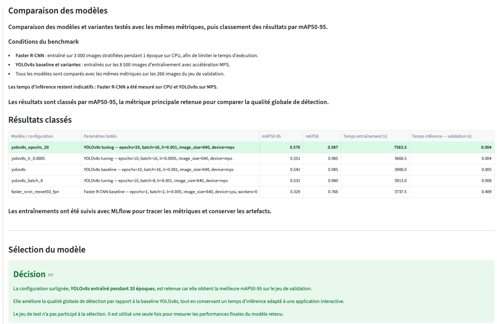
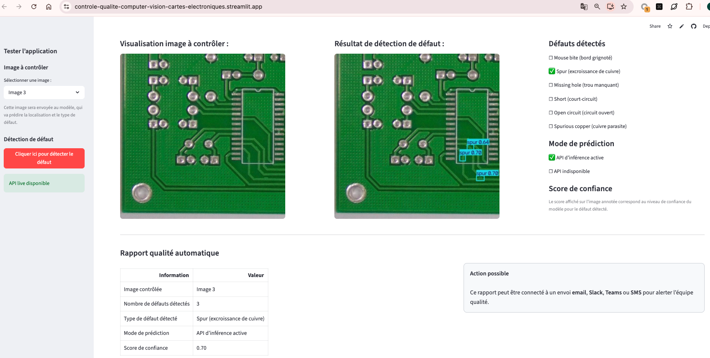
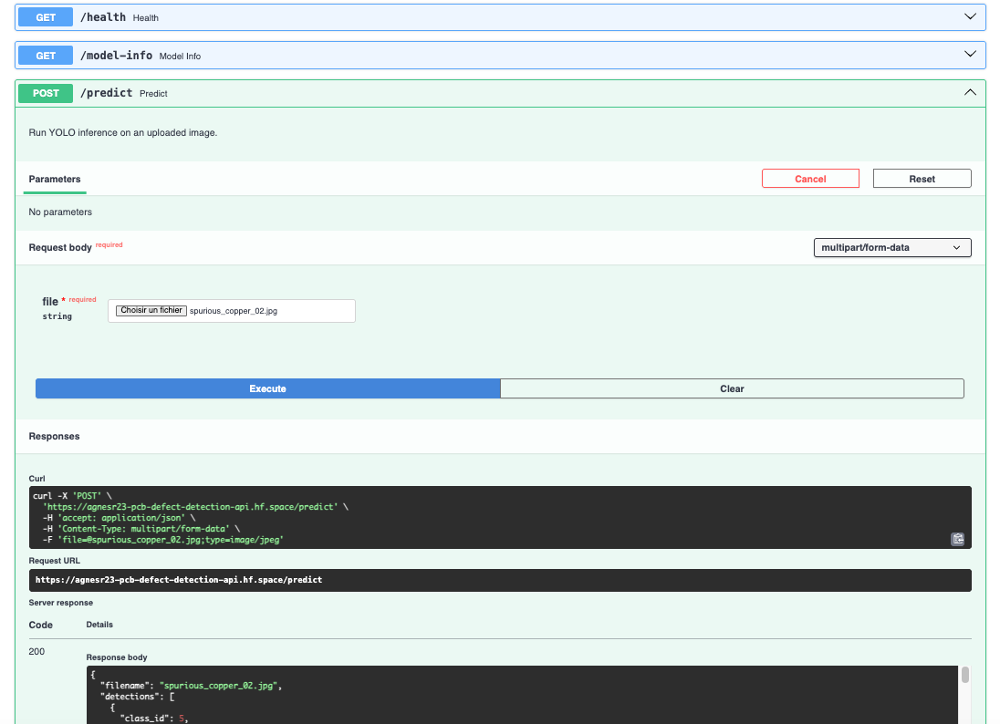

# Contrôle qualité de cartes électroniques par Computer Vision

## Objectif métier
Passer d’un contrôle visuel manuel à une détection automatique des défauts sur cartes électroniques.

---

## Démarche du projet

1. **Comparer les modèles de Computer Vision**  
   Benchmark entre Faster R-CNN, YOLOv8s baseline et plusieurs variantes YOLOv8s.

2. **Sélectionner le meilleur modèle**  
   Choix du modèle final à partir des métriques de détection et du temps d’inférence.

3. **Exposer l’inférence**  
   Création d’une API FastAPI avec documentation Swagger.

4. **Créer une démonstration métier**  
   Dashboard Streamlit permettant de tester une image et de générer un rapport qualité automatique.

---

## Choix du modèle



Modèle retenu : `yolov8s_epochs_20`

Les expérimentations et métriques de comparaison ont été suivies avec MLflow afin de tracer les essais et faciliter la sélection du modèle final.

| Métrique | Valeur |
|---|---:|
| mAP50-95 | 0.576 |
| mAP50 | 0.987 |
| Précision | 0.970 |
| Rappel | 0.986 |
| Temps d’inférence | 0.004 s |

Le modèle retenu offre le meilleur compromis entre qualité de détection et rapidité d’inférence.

---

## Déploiement et démonstration

Le dashboard et l’API sont déployés séparément :

- **dashboard** : Streamlit Community Cloud ;
- **API d’inférence** : Hugging Face Spaces.

### Fonctionnement du dashboard Streamlit

**Plateforme : Streamlit Community Cloud**



Le dashboard permet de :

- sélectionner une image à contrôler ;
- l’envoyer à l’API pour lancer l’inférence ;
- afficher l’image annotée et les résultats retournés ;
- générer automatiquement un rapport qualité.

> [!WARNING]
> Si l’API est indisponible, le dashboard le signale et n’affiche aucune prédiction statique.

### Fonctionnement de l’API FastAPI

**Plateforme : Hugging Face Spaces**



L’API permet de :

- recevoir une image à contrôler ;
- exécuter l’inférence avec le modèle ;
- détecter et localiser les défauts ;
- retourner le type de chaque défaut et son score de confiance ;
- retourner l’image annotée.

Endpoints principaux :

| Endpoint | Rôle |
|---|---|
| `/health` | Vérifier que l’API est disponible |
| `/model-info` | Afficher les informations du modèle |
| `/predict` | Envoyer une image et récupérer les prédictions |
| `/docs` | Accéder à la documentation Swagger |

---

## Organisation du projet

```text
notebooks/        benchmark, entraînement et sélection du modèle
src/              code d’inférence
api/              API FastAPI
app/              dashboard Streamlit
tests/            tests automatisés
docs/screenshots/ captures du README
```

Le modèle entraîné n’est pas versionné dans GitHub. Il est chargé localement s’il est présent, sinon récupéré depuis Hugging Face.

---

## Données

Les données utilisées pour l’entraînement et les images de démonstration proviennent du dataset Kaggle [PCB Defect Dataset — Norbert Elter](https://www.kaggle.com/datasets/norbertelter/pcb-defect-dataset), lui-même basé sur le dataset PCB Defect de Peking University. Les images incluses dans ce dépôt servent uniquement à illustrer le fonctionnement du projet, à des fins de démonstration non commerciale.

---

## Installation

```bash
conda env create -f environment.yml
conda activate pcb-defect-detection_env
```

---

## Lancer le projet en local

Lancer l’API :

```bash
uvicorn api.main:app --reload --port 8000
```

Swagger :

```text
http://127.0.0.1:8000/docs
```

Lancer Streamlit dans un deuxième terminal :

```bash
streamlit run app/streamlit_app.py
```

---

## Lancer l’API avec Docker

```bash
docker build -f api/Dockerfile -t controle-qualite-cv-cartes-electroniques-api .
docker run --rm -p 8000:7860 controle-qualite-cv-cartes-electroniques-api
```

Swagger :

```text
http://127.0.0.1:8000/docs
```

---

## Tests

```bash
pytest
```

Tests validés localement :

```text
test_metrics.py      OK
test_app_assets.py   OK
test_inference.py    OK
test_api.py          OK
test_data.py         OK
```

---

## Stack technique

Python 3.11 · YOLOv8 · PyTorch · FastAPI · Streamlit · Docker · Pytest · Hugging Face Spaces

---

## Licence

Copyright © 2026 Agnès REGAUD.

Ce projet est distribué sous licence [GNU Affero General Public License v3.0](LICENSE). Il utilise Ultralytics YOLOv8 sous licence AGPL-3.0.

---

## Auteur

Projet réalisé par Agnès REGAUD.

LinkedIn : https://www.linkedin.com/in/agnes-regaud/
